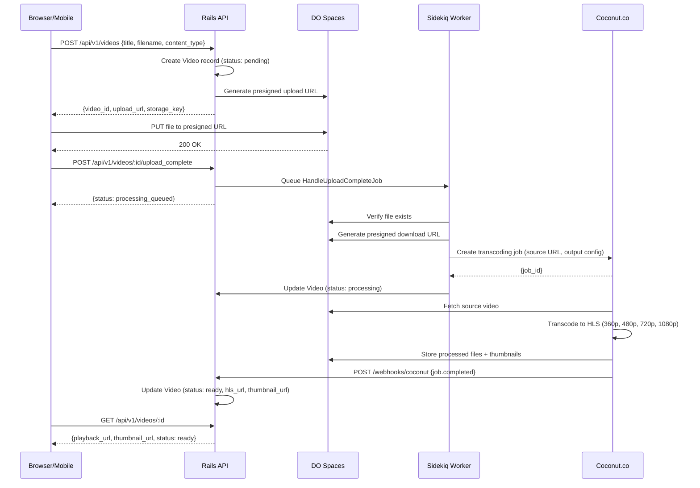
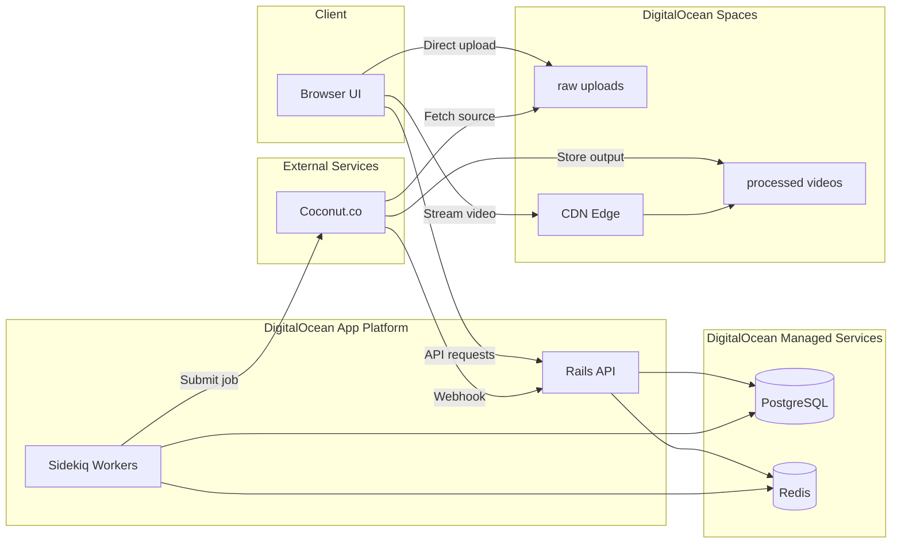
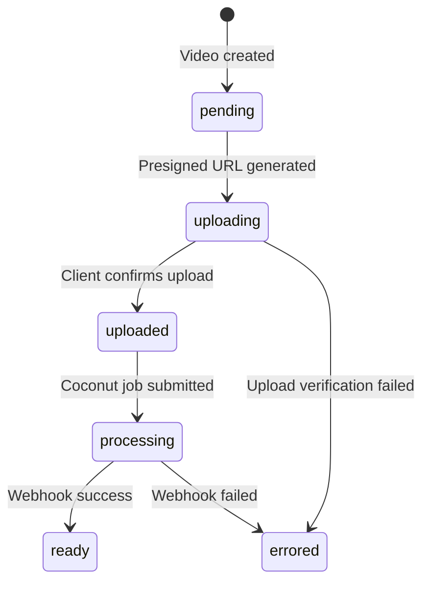

# Video Upload System Design

**Context:** 5 developers, 6-month timeline, 20-50k DAU (Canada + Europe), mobile and desktop uploads.

---

## 1. System Architecture Diagram



---
## System Components  
  


---

**Video State Machine:**



---


## 2. Technology Stack

| Layer | Choice | Rationale |
|-------|--------|-----------|
| API | Ruby on Rails | fast development, good ecosystem |
| Database | PostgreSQL | Video metadata is relational, mature, reliable |
| Object Storage | DigitalOcean Spaces | S3-compatible, $5/250GB, EU regions available |
| Background Jobs | Sidekiq + Redis | Simple, proven, handles async workflows well |
| Transcoding | Coconut.co | Managed transcoding API, S3-compatible output, cheaper than Mux, eliminates FFmpeg ops burden |
| CDN | Digital Ocean | Free tier generous, global network, easy setup |
| Output Format | HLS | Adaptive bitrate streaming, broad device support |

**Why not:**
- Self-hosted FFmpeg: Ops burden too high for 5 devs
- Kafka/RabbitMQ: Overkill for this scale, Sidekiq sufficient
- Kubernetes: ECS/Fargate simpler; K8s expertise expensive

---

## 3. Design Trade-offs & Assumptions

**Assumptions:**
- Max file size: 5GB
- Presigned URL expiry: 15 minutes
- Rate limit: 10 uploads/hour per user
- Output resolutions: 360p, 480p, 720p, 1080p

**Trade-offs:**

| Decision | Trade-off |
|----------|-----------|
| Managed transcoding vs self-hosted | Higher per-minute cost (~$0.015/min) but eliminates ops burden. Worth it for 5 devs. |
| Async transcoding | User sees "processing" for minutes after upload. Better UX than blocking, simpler architecture. |
| Multi-region | For Canada + Europe coverage, would add second region (ca-central-1) behind Cloudflare load balancer with geo-routings|
| Transcode all resolutions upfront | Wastes compute on unwatched videos. Simpler than on-demand, predictable costs. |
| Eventual consistency for status | User may briefly see stale status. Acceptable, avoids distributed transactions. |
| Keep original uploads | Higher storage cost but enables re-transcoding for future formats. |
| Presigned URLs vs proxy | API doesn't handle video bytes (better scalability). URL sharing mitigated by short expiry. |

---

## 4. API Specification

**Create Video**
```
POST /api/v1/videos
Content-Type: application/json

Request:  { "title": "My Video", "filename": "video.mp4", "content_type": "video/mp4" }
Response: { "video_id": "abc123", "upload_url": "https://...", "storage_key": "uploads/abc123/video.mp4" }
```

**Confirm Upload**
```
POST /api/v1/videos/:id/upload_complete

Response: { "status": "processing_queued" }
```

**Get Video**
```
GET /api/v1/videos/:id

Response: { "id": "abc123", "title": "My Video", "status": "ready", "playback_url": "https://...", "thumbnail_url": "https://..." }
```

**Webhook (Coconut)**
```
POST /webhooks/coconut
{ "job_id": "...", "status": "completed", "outputs": { "hls": "https://...", "thumbnail": "https://..." } }
```

---

## 5. Transcoding Configuration 

```json
{
  "input": { "url": "https://spaces.../uploads/abc123/video.mp4" },
  "storage": { "service": "s3", "bucket": "processed-videos" },
  "notification": { "url": "https://api.example.com/webhooks/coconut" },
  "outputs": {
    "httpstream": [{
      "hls": { "path": "/videos/abc123/" },
      "variants": [
        "mp4:360p::quality=4,maxrate=1000k",
        "mp4:480p::quality=4,maxrate=1500k",
        "mp4:720p::quality=4,maxrate=2000k",
        "mp4:1080p::quality=4,maxrate=4000k"
      ]
    }]
  }
}
```

---

## 6. Operational Notes 

**Fault tolerance:**
- Failed transcoding jobs go to dead-letter queue for manual inspection
- Files failing validation twice are marked as errored and user is notified
- Resumable uploads (multipart) for mobile users and large files

**Storage structure:**
```
/uploads/{video_id}/original.mp4
/processed/{video_id}/playlist.m3u8
/processed/{video_id}/360p/
/processed/{video_id}/720p/
/processed/{video_id}/thumbnail.jpg
```

**Monitoring:**
- Track upload success rate, transcoding latency, error rates
- Alert on webhook failures, queue depth spikes
- 

